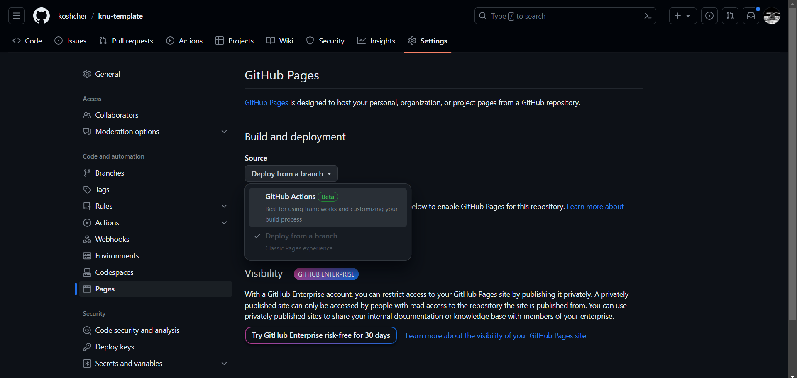

# KNU template

Шаблон для сайту звітів, ...

## Для початку роботи:

1. В налаштуваннях репозиторію включи сторінки з GitHub Actions: 

2. В файлі [config.js](./site/.vitepress/config.js) змінити в `base` knu-template на назву твого репозиторія.

3. В файлі [config.js](./site/.vitepress/config.js) змінити ім'я студента.

4. Відредагуй [intex.md](./site/index.md) зі своїм ім'ям та викладачами.

## Для додавання сторінок

Кожна сторінка це .md файл, що він з'явився в навігації додайте інформацію про нього в файлі [config.js](./site/.vitepress/config.js). Наприклад, нова сторінка `labs/2.md`, матиме такий код:

```js
export default defineConfig({
  ..
  themeConfig: {
    ...,
    sidebar: [
      ...,
      {
        text: "Лабораторні роботи",
        items: [
          ...,
          { text: "Лабораторна робота №2", link: "/labs/2" }
        ],
      },
    ],
  },
})
```

В кожен `.md` файл додавайте у верх такі строки:

```
---
outline: deep
---
```

Для розширеної навігації по сторінці.
